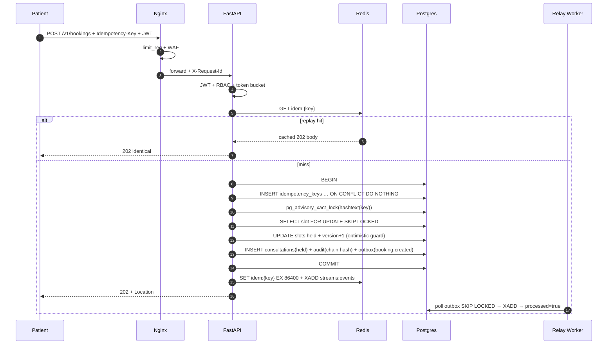
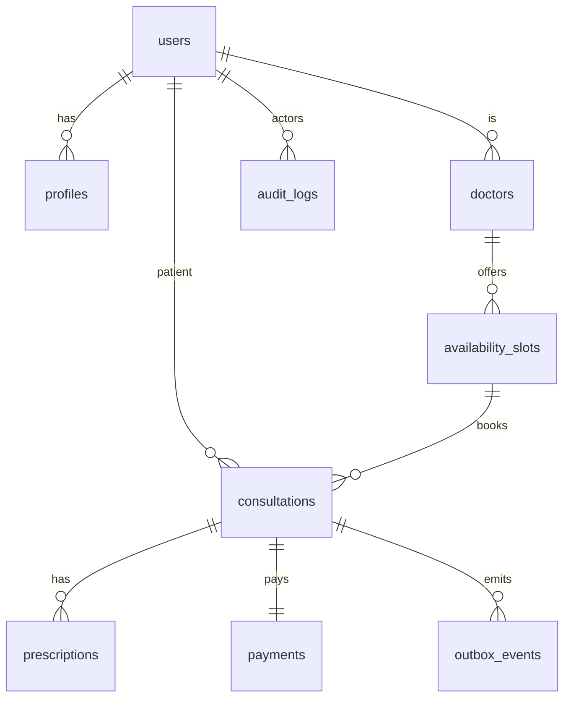

# Architecture — Amrutam Telemedicine Backend (2–4 pages)

## 1. Overview

Stateless FastAPI replicas behind Nginx (TLS, edge rate-limit, health-evicting LB).
Writes go to Postgres Primary in one transaction that also appends an outbox row;
an `arq`-style relay worker publishes outbox rows to Redis Streams and settles the
payment saga. Reads for search/analytics come from a Postgres read replica. Redis
provides cache, idempotency replay, token-bucket rate limits, and the stream.
MinIO (S3-compatible) stores Rx PDFs and backups. OTel → Prometheus/Loki/Tempo →
Grafana covers metrics/logs/traces.

```
Clients → Nginx (:8443 TLS, limit_req, max_fails=3) → api × N (uvicorn, :8000)
  → Postgres Primary (RW) + Replica (RO) + Redis + MinIO
  → OTel Collector → Prometheus / Loki / Tempo → Grafana
```

Scale targets: 100k consultations/day (~1.2 rps avg, ~50 rps peak),
p95 <200ms reads / <500ms writes, 99.95% (~21 min/month budget).

## 2. Booking flow (sequence)



Why `202`: payment settles asynchronously (saga). Why Postgres locks, not Redis
redlock: single source of truth, no fencing-token bugs; Redis is replay cache only.

## 3. ER diagram (core)



Partitioning: `availability_slots` HASH(`doctor_id`)×8; `consultations`
RANGE(`created_at`) monthly (+DEFAULT); `audit_logs` RANGE(`ts`) weekly
(+DEFAULT). Rationale: hot-doctor spread, time-series drop via DETACH, 36M
rows/yr stays prunable. Keyset pagination everywhere (`(created_at,id) < (?,?)`).

## 4. Saga & transactions

One PG transaction per use case (unit of work; repos never commit). Cross-system
work (payment gateway) uses transactional outbox + compensations:
`paid → confirmed/booked`; `failed → cancelled/open + refund row`. Consumers are
idempotent (`ON CONFLICT DO NOTHING`, status guards) → at-least-once delivery,
effectively-once processing. Held slots expire via TTL compensation (15 min).

## 5. Caching, retry, rate limits

- Cache: hot doctor/slot reads + idempotency bodies (TTL 24h); write-through
  invalidation on booking. Hit/miss on Redis dashboard.
- Retry: exponential backoff+jitter on idempotent external calls only
  (gateway, SMS); never blindly retry non-idempotent writes.
- Limits: Nginx `20r/s IP + 10r/s JWT` coarse + Redis token bucket fine-grained
  (30/min booking & payments per user). Health: `/health` liveness, `/ready`;
  Nginx evicts after 3 fails (99.95% story with `--scale api=3`).

## 6. Scaling narrative (measured)

k6 (`infra/k6/load.js`, in-network vs `api:8000`, 3 replicas):
- SLO run (20 read VUs + 10 write VUs, ~220 rps): reads p95 **30ms** ✓,
  writes p95 **134ms** ✓, 100% checks.
- Stress (500 read VUs + 20 write VUs, ~380 rps): reads p95 1.8s ✗ — pool-bound
  (20+15 conns/replica). Fix: bigger pools, more replicas, PgBouncer; operating
  point (~50 rps peak) has 4× headroom. Audit chain lock serializes writers by
  design (correctness first; async writer is the escape hatch).

## 7. Backup & DR

PG WAL → MinIO; replica lag alert >10s; RPO <5 min, RTO <30 min (promote + compose
restart). Audit cold archive 7 yr parquet (DPDP/IT Act). Secrets: env locally,
`/run/secrets` + shared `jwt-secrets` volume in compose (one RS256 pair for all
replicas — generated once, reused on scale), KMS in prod.
